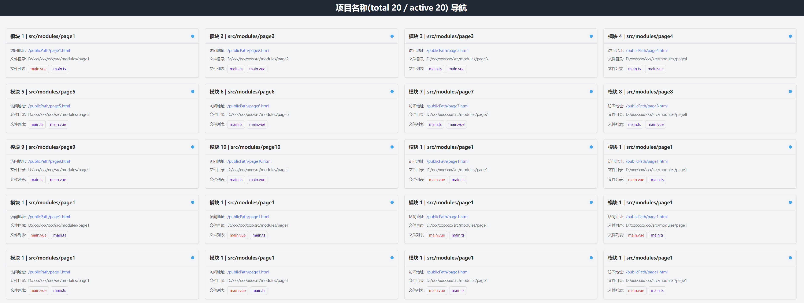

<!-- markdownlint-disable MD033 -->
# unplugin-nav-entry

提供一个导航页面，支持 Vite、Webpack、vue-cli

+ 快速定位、访问具体页面
+ 快速打开页面源码
+ 对整个项目的功能模块有一个简短的认知



## 安装

```bash
npm i unplugin-nav-entry
```

<details>
<summary>Vite</summary>

<br>

```ts
// vite.config.ts
import NavEntry from 'unplugin-nav-entry/vite'

export default defineConfig({
  plugins: [
    NavEntry({ /* options */ })
  ]
})
```

<br>

</details>

<details>
<summary>Webpack</summary>

<br>

```ts
// webpack.config.js
module.exports = {
  /* ... */
  plugins: [
    require('unplugin-nav-entry/webpack')({ /* options */ })
  ]
}
```

<br>

</details>

<details>
<summary>Vue CLI</summary>

<br>

```ts
// vue.config.js
module.exports = {
  configureWebpack: {
    plugins: [
      require('unplugin-nav-entry/webpack')({ /* options */ }),
    ],
  },
}
```

<br>

</details>

## 使用

项目集成参考下面两种用法，需要做的是确认 source 和 cwd 配置项是否与默认配置的一致，如果不一致，则需要修改，如果一致，则只需要提供 `titleRule` 配置项来匹配页面标题，如果页面标题是一个动态的变量，那么建议在项目根目录下提供一个路径和标题的映射关系文件，并使用 `resolveTitle` 配置项来解析标题信息

集成后，webpack 项目访问地址为 `/__entry.html`，vite 项目访问地址为 `/__entry`

### 简单用法

```js
// vue.config.js
module.exports = {
  configureWebpack: {
    plugins: [
      require('unplugin-nav-entry/webpack')({
        source: '**/main.js',
        cwd: 'src/modules',
        titleRule: [
          /window\.document\.title\s?=\s?['"](.*?)['"]/
        ],
        urlScheme: 'vscode',
      }),
    ],
  },
}
```

### 复杂用法

<details>
<summary>复杂用法示例</summary>

<br>

```ts
// vite.config.ts
import { readFileSync } from 'node:fs'
import NavEntry from 'unplugin-nav-entry/vite'

export default defineConfig({
  plugins: [
    NavEntry({
      source: '**/main.ts',
      cwd: 'src/modules',
      urlScheme: 'vscode',
      titleRule: [/document\.title\s?=\s?['"](.*?)['"]/],
      resolvePath: (sourcePath, file, absFile) => {
        const paths = sourcePath.split('/').filter(Boolean)
        return `/${[paths[0], 'src/template', ...paths.slice(1)].join('/')}`
      },
      resolveTitle: (sourceTitle, pageRelativeDir) => {
        if (sourceTitle)
          return `${sourceTitle} | ${pageRelativeDir}`
        const p = `${pageRelativeDir.replace('src/modules', 'src/template')}.html`
        const html = readFileSync(p, 'utf-8')
        const match = html.match(/<title>(.*?)<\/title>/)
        if (match) {
          const t = match[1]
          return t ? `${t} | ${pageRelativeDir}` : pageRelativeDir
        }
        return pageRelativeDir
      }
    }),
  ],
})
```

<br>

</details>

### 默认配置

```ts
export const defaultOptions: Options = {
  source: '**/main.ts',
  cwd: 'src/modules',
  urlScheme: 'vscode',
  titleRule: [],
  open: false,
  resolvePath: (sourcePath, _visitPath, _absoluteVisitPath) => {
    return sourcePath
  },
  resolveTitle: (sourceTitle, pageRelativeDir) => {
    return sourceTitle ? `${sourceTitle} | ${pageRelativeDir}` : pageRelativeDir
  },
  fgOptions: {
    absolute: true,
    ignore: ['**/node_modules/**'],
  },
}
```

### 详细配置项

#### source

+ 类型: `string | string[]`
+ 默认值: `**/main.ts`

匹配规则，支持 glob 语法，例如 `**` 代表任意层级，`*` 代表任意字符

#### cwd

+ 类型: `string`
+ 默认值: `src/modules`

工作目录，相对于项目根目录

#### titleRule

+ 类型: `RegExp | RegExp[]`
+ 默认值: `[]`

标题匹配正则，用于匹配页面标题，示例如下：

示例 1

+ 源码: `window.document.title = 'xxxxxxxxxxxxxxxxxxxxxx'`
+ 正则: `/window\.document\.title\s?=\s?['"](.*?)['"]/`

示例 2

+ 源码: `<my-base title="xxxxxxxxxxxxxxxxxxxxxx"></my-base>`
+ 正则: `/<my-base\stitle=['"](.*?)['"]><\/my-base>/`

#### urlScheme

+ 类型: `vscode | vscode-insiders | webstorm | string`
+ 默认值: `vscode`

编辑器打开文件的 UrlScheme，其中内置了几个默认的 scheme，分别是 `vscode`、`vscode-insiders`、`webstorm`

如果使用的编辑器不是这几个，可以传入自定义的 scheme 地址，可选变量为：

+ `$absolute`: 文件绝对路径
+ `$relative`: 文件相对路径
+ `$projectName`: 项目名称

注意：

1. vscode 只会选择最后一个聚焦的窗口打开文件，所以在配合开发时，尽量不要切到其他 vscode 窗口
2. webstorm 需要安装 [JetBrains Toolbox](https://www.jetbrains.com/zh-cn/toolbox-app/) 才能打开文件，这是因为 webstorm 的 UrlScheme 机制是通过 toolbox 来实现的

#### open

+ 类型: `boolean`
+ 默认值: `false`

是否自动打开页面导航入口，仅支持 vite

#### mainVue

+ 类型: `string`
+ 默认值: `''`

当遇到一个模块下存在多个相似入口时，通过 mainVue 来提高匹配标题信息的优先级

匹配优先级：

`main.js` > `[options.mainVue]` > `main.vue` > `index.vue` > `<basename>.vue`

#### fgOptions

+ 类型: `object`
+ 默认值: `{ absolute: true, ignore: ['**/node_modules/**'] }`

参考其他 [fast-glob](https://github.com/mrmlnc/fast-glob?tab=readme-ov-file#options-3) 配置项

#### resolvePath

+ 类型: `(sourcePath: string, visitPath: string, absoluteVisitPath: string) => string`
+ 默认值: `(sourcePath, visitPath, absoluteVisitPath) => sourcePath`

解析模块的最终访问地址

+ `sourcePath`: 当前处理后的访问地址，`/<BASE>/foo.html`
+ `visitPath`: 文件相对路径，`src/modules/foo/main.js`
+ `absoluteVisitPath`: 文件绝对路径，`D:/xxx/xxx/src/modules/foo/main.js`

#### resolveTitle

+ 类型: `(sourceTitle: string, pageRelativeDir: string) => string`
+ 默认值: ```(sourceTitle, pageRelativeDir) => sourceTitle ? `${sourceTitle} | ${pageRelativeDir}` : pageRelativeDir```

解析模块的最终标题信息

+ `sourceTitle`: 当前处理后的标题信息，`xxxxxxxxxxxxxxxxxxxxxx`
+ `pageRelativeDir`: 模块相对路径，`src/modules/foo`

#### resolveEntries

+ 类型: `() => string[]`
+ 默认值: `undefined`

解析模块的入口地址，用于判断一个模块是否属于本次构建模块，如果内部处理的入口地址不符合预期，可以通过该配置项来返回入口地址列表

Entries 的格式应该如下所示：

```json
[
  "/src/modules/foo",
  "/src/modules/bar",
  "/src/modules/baz"
]
```
